# EXNO:4-DS
# AIM:
To read the given data and perform Feature Scaling and Feature Selection process and save the
data to a file.

# ALGORITHM:
STEP 1:Read the given Data.
STEP 2:Clean the Data Set using Data Cleaning Process.
STEP 3:Apply Feature Scaling for the feature in the data set.
STEP 4:Apply Feature Selection for the feature in the data set.
STEP 5:Save the data to the file.

# FEATURE SCALING:
1. Standard Scaler: It is also called Z-score normalization. It calculates the z-score of each value and replaces the value with the calculated Z-score. The features are then rescaled with x̄ =0 and σ=1
2. MinMaxScaler: It is also referred to as Normalization. The features are scaled between 0 and 1. Here, the mean value remains same as in Standardization, that is,0.
3. Maximum absolute scaling: Maximum absolute scaling scales the data to its maximum value; that is,it divides every observation by the maximum value of the variable.The result of the preceding transformation is a distribution in which the values vary approximately within the range of -1 to 1.
4. RobustScaler: RobustScaler transforms the feature vector by subtracting the median and then dividing by the interquartile range (75% value — 25% value).

# FEATURE SELECTION:
Feature selection is to find the best set of features that allows one to build useful models. Selecting the best features helps the model to perform well.
The feature selection techniques used are:
1.Filter Method
2.Wrapper Method
3.Embedded Method

# CODING AND OUTPUT:

```
# FEATURE SCALING
import pandas as pd
from scipy import stats
import numpy as np
```
```
df=pd.read_csv("bmi.csv")
df.head()
```
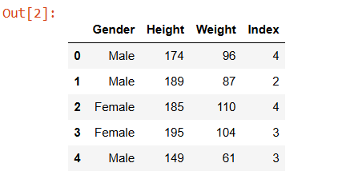
```
df_null_sum=df.isnull().sum()
df_null_sum
```
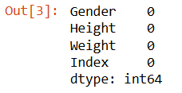
```
df.dropna()
```
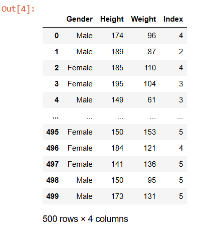
```
max_vals = np.max(np.abs(df[['Height', 'Weight']]), axis=0)
max_vals
# This is typically used in feature scaling,
#particularly max-abs scaling, which is useful
#when you want to scale data to the range [-1, 1]
#while maintaining sparsity (often used with sparse data).

```
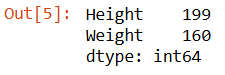
```
# Standard Scaling
from sklearn.preprocessing import StandardScaler
df1=pd.read_csv("bmi.csv")
df1.head()
```
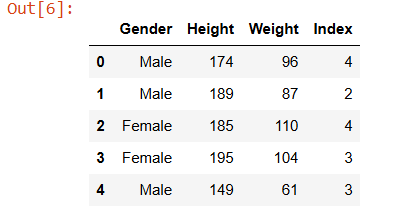
```
sc=StandardScaler()
df1[['Height','Weight']]=sc.fit_transform(df1[['Height','Weight']])
df1.head(10)
```
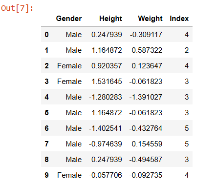
```
#MIN-MAX SCALING:
from sklearn.preprocessing import MinMaxScaler
scaler=MinMaxScaler()
df[['Height','Weight']]=scaler.fit_transform(df[['Height','Weight']])
df.head(10)
```
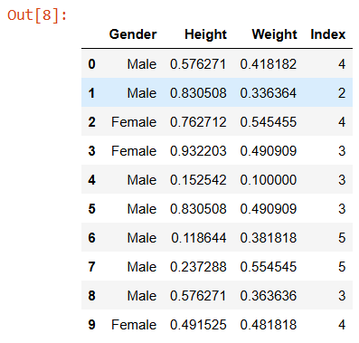
```
#MAXIMUM ABSOLUTE SCALING:
from sklearn.preprocessing import MaxAbsScaler
scaler = MaxAbsScaler()
df3=pd.read_csv("bmi.csv")
df3.head()
df[['Height','Weight']]=scaler.fit_transform(df[['Height','Weight']])
df

```
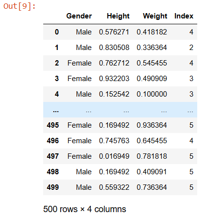
```
#ROBUST SCALING
from sklearn.preprocessing import RobustScaler
scaler = RobustScaler()
df3[['Height','Weight']]=scaler.fit_transform(df3[['Height','Weight']])
df3.head()

```
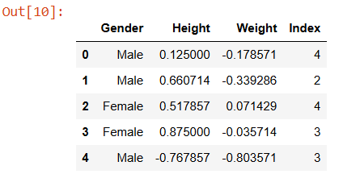
```
#FEATURE SELECTION:
df=pd.read_csv("income(1) (1).csv")
df.info()
```
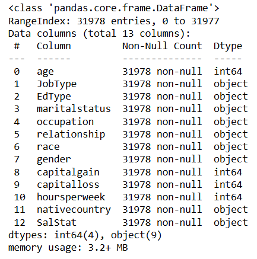
```
df_null_sum=df.isnull().sum()
df_null_sum
```
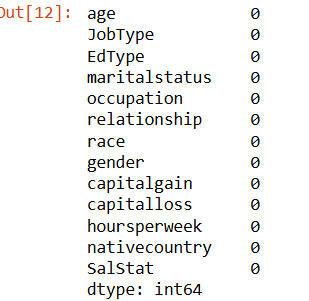
```
# Chi_Square
categorical_columns = ['JobType', 'EdType', 'maritalstatus', 'occupation', 'relationship', 'race', 'gender', 'nativecountry']
df[categorical_columns] = df[categorical_columns].astype('category')
#In feature selection, converting columns to categorical helps certain algorithms
# (like decision trees or chi-square tests) correctly understand and
# process non-numeric features. It ensures the model treats these columns as categories,
# not as continuous numerical values.
df[categorical_columns]

```
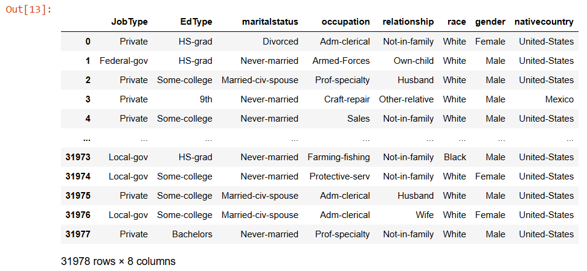
```
df[categorical_columns] = df[categorical_columns].astype('category')
df[categorical_columns] = df[categorical_columns].apply(lambda x: x.cat.codes)
##This code replaces each categorical column in the DataFrame with numbers that represent the categories.
df[categorical_columns]
```
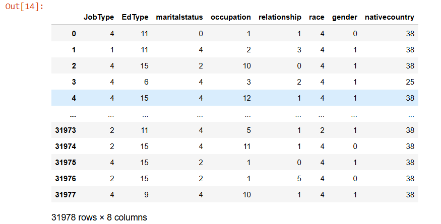
```
X = df.drop(columns=['SalStat'])
y = df['SalStat']
#X contains all columns except 'SalStat' — these are the input features used to predict something.
#y contains only the 'SalStat' column — this is the target variable you want to predict.
from sklearn.model_selection import train_test_split
from sklearn.metrics import accuracy_score
from sklearn.ensemble import RandomForestClassifier
X_train, X_test, y_train, y_test = train_test_split(X, y, test_size=0.3, random_state=42)
rf = RandomForestClassifier(n_estimators=100, random_state=42)
rf.fit(X_train, y_train)

```
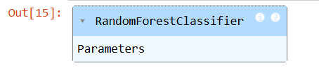
```
y_pred = rf.predict(X_test)
df=pd.read_csv("income(1) (1).csv")
df.info()
```
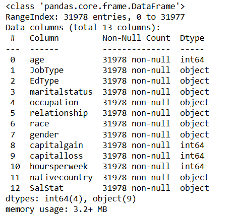
```
import pandas as pd
from sklearn.feature_selection import SelectKBest, chi2, f_classif
categorical_columns = ['JobType', 'EdType', 'maritalstatus', 'occupation', 'relationship', 'race', 'gender', 'nativecountry']
df[categorical_columns] = df[categorical_columns].astype('category')
df[categorical_columns]

```
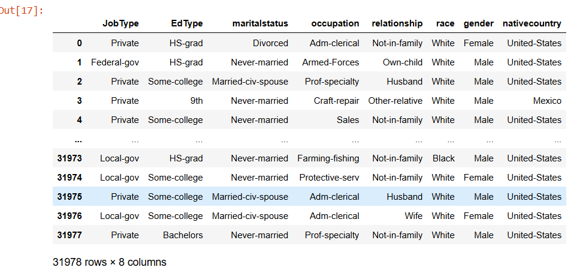
```
df[categorical_columns] = df[categorical_columns].apply(lambda x: x.cat.codes)
df[categorical_columns]

```
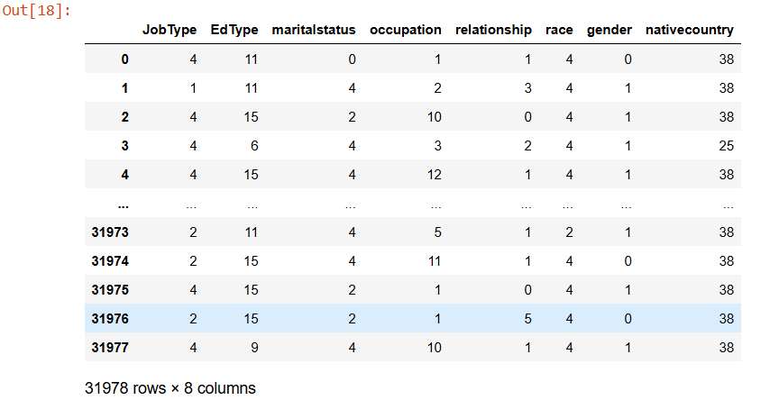
```
import pandas as pd
from sklearn.feature_selection import SelectKBest, chi2, f_classif
from sklearn.model_selection import train_test_split # Importing the missing function
from sklearn.ensemble import RandomForestClassifier
selected_features = ['age', 'maritalstatus', 'relationship', 'capitalgain', 'capitalloss',
'hoursperweek']
X = df[selected_features]
y = df['SalStat']
X_train, X_test, y_train, y_test = train_test_split(X, y, test_size=0.3, random_state=42)
rf = RandomForestClassifier(n_estimators=100, random_state=42)
rf.fit(X_train, y_train)
```
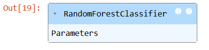
```
y_pred = rf.predict(X_test)
from sklearn.metrics import accuracy_score
accuracy = accuracy_score(y_test, y_pred)
print(f"Model accuracy using selected features: {accuracy}")
```
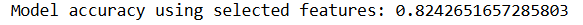
```
!pip install skfeature-chappers
```
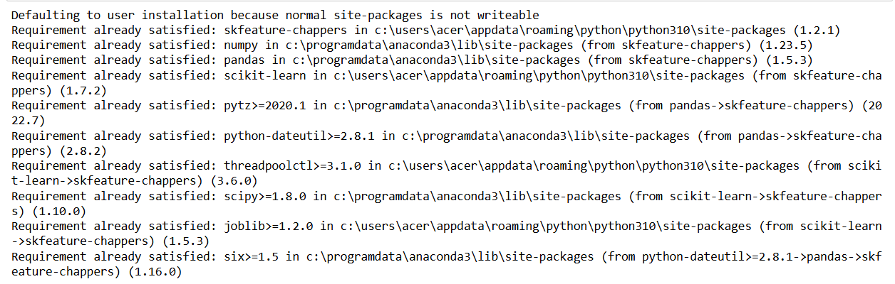
```
import numpy as np
import pandas as pd
from skfeature.function.similarity_based import fisher_score
from sklearn.ensemble import RandomForestClassifier
from sklearn.model_selection import train_test_split
from sklearn.metrics import accuracy_score
```
```
categorical_columns = [
'JobType',
'EdType',
'maritalstatus',
'occupation',
'relationship',
'race',
'gender',
'nativecountry'
]
df[categorical_columns] = df[categorical_columns].astype('category')
```
```
df[categorical_columns] = df[categorical_columns].apply(lambda x: x.cat.codes)
# @title
df[categorical_columns]
```
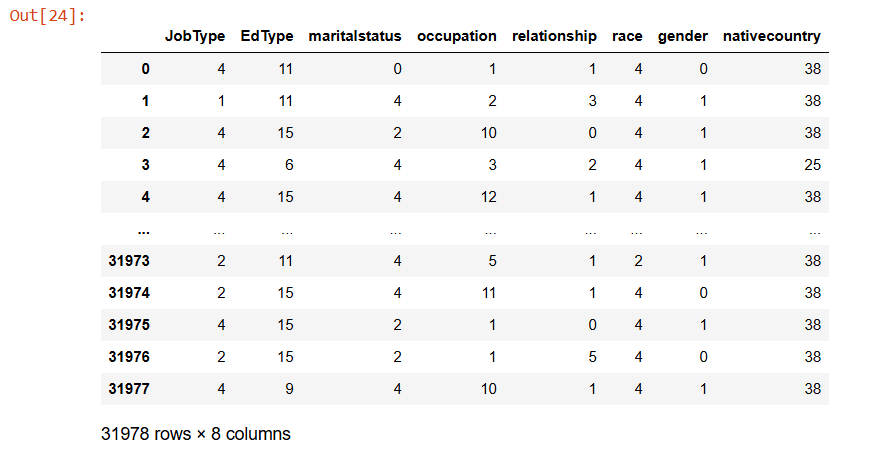
```
X = df.drop(columns=['SalStat'])
y = df['SalStat']
```
```
k_anova = 5
selector_anova = SelectKBest(score_func=f_classif,k=k_anova)
X_anova = selector_anova.fit_transform(X, y)
```
```
selected_features_anova = X.columns[selector_anova.get_support()]
```
```
print("\nSelected features using ANOVA:")
print(selected_features_anova)
```
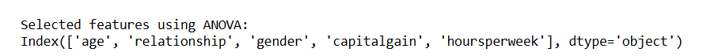
```
# Wrapper Method
import pandas as pd
from sklearn.feature_selection import RFE
from sklearn.linear_model import LogisticRegression
df=pd.read_csv("income(1) (1).csv")
# List of categorical columns
categorical_columns = [
'JobType',
'EdType',
'maritalstatus',
'occupation',
'relationship',
'race',
'gender',
'nativecountry'
]
# Convert the categorical columns to category dtype
df[categorical_columns] = df[categorical_columns].astype('category')
```
```
df[categorical_columns] = df[categorical_columns].apply(lambda x: x.cat.codes)
```
```
df[categorical_columns]
```
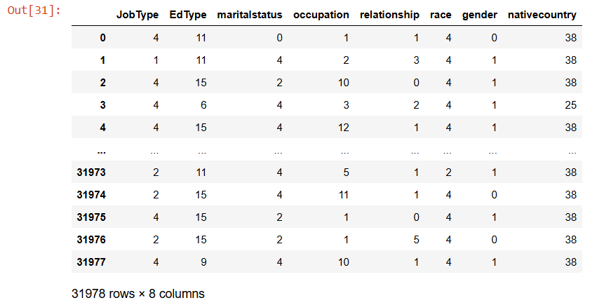
```
X = df.drop(columns=['SalStat'])
y = df['SalStat']
```
```
logreg = LogisticRegression()
```
```
n_features_to_select =6
```
```
rfe = RFE(estimator=logreg, n_features_to_select=n_features_to_select)
rfe.fit(X, y)
```
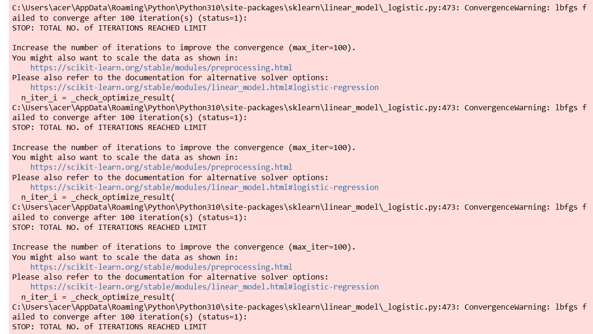
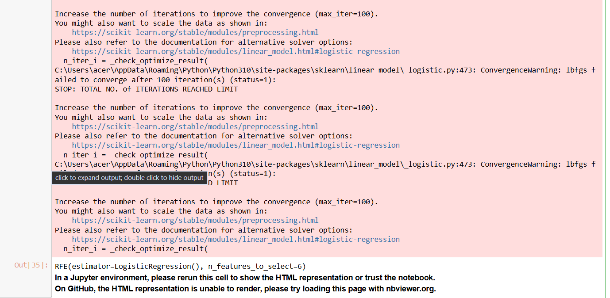

# RESULT:
Thus the Feature Scaling and selection Executed successfully.
